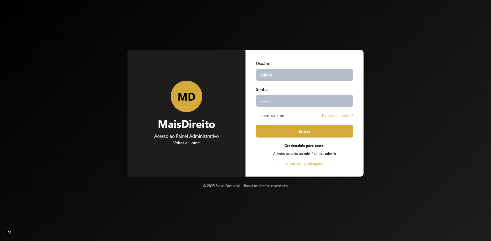

# MaisDireito Advogados - Website e Painéis Administrativos

<div align="center">
  
  <br><br>
  
  [](https://nextjs.org/)
  [](https://reactjs.org/)
  [](https://developer.mozilla.org/en-US/docs/Web/JavaScript)
  [](https://github.com/css-modules/css-modules)
  [](https://en.wikipedia.org/wiki/Responsive_web_design)
</div>

## 📋 Sobre o Projeto

Este projeto consiste em um site institucional completo para um escritório de advocacia, juntamente com painéis administrativos para o gerenciamento interno do escritório e para uso exclusivo dos advogados. Desenvolvido com Next.js, o sistema oferece uma experiência moderna para visitantes e plataformas robustas para gestão operacional e atividade jurídica.

## 🖼️ Screenshots

### Página Inicial


_Website moderno e elegante que apresenta os serviços do escritório de advocacia com design profissional e sofisticado. A experiência de usuário foi cuidadosamente elaborada para transmitir credibilidade e expertise._

### Área do Cliente


_Portal exclusivo para clientes acompanharem seus processos, documentos e comunicações com o escritório. Interface intuitiva que permite acesso rápido às informações mais relevantes._

### Painel Administrativo


_Área restrita para gerenciamento completo do escritório, incluindo gestão de clientes, processos, financeiro, agenda e métricas de desempenho. Dashboard intuitivo com informações consolidadas._

### Tela de Login para Administração


_Portal de acesso seguro ao sistema administrativo, com interface limpa e direta. Implementa medidas de segurança robustas para proteger os dados sensíveis._

## 🏗️ Estrutura do Projeto

O projeto é dividido em três partes principais:

1. **Website Institucional**: Voltado para o público externo, apresentando informações sobre o escritório, áreas de atuação, equipe e formas de contato.

2. **Painel Administrativo**: Área restrita para gestão interna do escritório, incluindo controle de clientes, financeiro, estoque, RH e mais.

3. **Painel do Advogado**: Área exclusiva para advogados gerenciarem seus processos, clientes, agenda e desempenho profissional.

## 🚀 Tecnologias Utilizadas

- **Next.js**: Framework React para desenvolvimento de aplicações web com renderização do lado do servidor (SSR) e geração estática (SSG)
- **React**: Biblioteca JavaScript para construção de interfaces de usuário interativas e componentizadas
- **CSS Modules**: Solução para estilos modulares que evita conflitos de nomes de classes
- **JavaScript**: Linguagem de programação utilizada para implementar a lógica de negócio do frontend
- **Responsividade**: Design adaptável a diferentes dispositivos, desde smartphones até desktops

## ⚙️ Como Executar o Projeto

### Pré-requisitos

- Node.js (versão 18.0.0 ou superior)
- npm ou yarn

### Instalação

1. Clone o repositório:

```bash
git clone https://github.com/seu-usuario/maisdireito.git
cd maisdireito
```

2. Instale as dependências:

```bash
npm install
# ou
yarn install
```

3. Execute o servidor de desenvolvimento:

```bash
npm run dev
# ou
yarn dev
```

4. Acesse o projeto no navegador:

```
http://localhost:3000 - Website
http://localhost:3000/admin - Painel Administrativo
http://localhost:3000/advogado - Painel do Advogado
```

### Credenciais para Teste

#### Painel Administrativo

```
Usuário: admin
Senha: admin
```

#### Painel do Advogado

```
Usuário: advogado
Senha: admin
```

## 💡 Principais Funcionalidades

### Website

- **Página Inicial**: Apresentação do escritório com seções principais destaque para áreas de atuação e chamadas para ação
- **Quem Somos**: História, missão, visão e valores do escritório, com perfil dos fundadores
- **Áreas de Atuação**: Apresentação detalhada das especialidades jurídicas, incluindo direito civil, trabalhista, tributário e empresarial
- **Equipe**: Apresentação dos sócios e advogados com suas áreas de especialização e formação acadêmica
- **Publicações**: Artigos e notícias jurídicas produzidos pela equipe, organizados por temas e categorias
- **Contato**: Formulário inteligente, informações de contato e mapa interativo da localização

### Painel Administrativo

- **Dashboard**: Visão geral dos indicadores importantes do escritório
- **Gestão de Clientes**: Cadastro completo, histórico de atendimentos e documentação
- **Gestão Financeira**: Controle de receitas, despesas, faturamento e relatórios
- **Gestão de Processos**: Acompanhamento de processos judiciais com alertas para prazos
- **Recursos Humanos**: Gestão de colaboradores, cargos, salários e benefícios
- **Relatórios**: Geração de relatórios customizáveis com gráficos e exportação em diversos formatos

### Painel do Advogado

- **Agenda Personalizada**: Visualização e gestão de compromissos, audiências e prazos
- **Gestão de Processos**: Acompanhamento dos processos sob responsabilidade do advogado
- **Clientes Vinculados**: Acesso aos dados e documentos dos clientes associados
- **Produtividade**: Métricas de desempenho e acompanhamento de metas
- **Banco de Modelos**: Repositório de documentos jurídicos padronizados para uso

Para informações mais detalhadas sobre os painéis, consulte:

- [Documentação do Painel Administrativo](./README-ADMIN.md)
- [Documentação do Painel do Advogado](./README-ADVOGADO.md)

## 🎨 Personalização

### Cores e Temas

O projeto utiliza variáveis CSS para facilitar a personalização. As principais variáveis estão definidas em `src/app/globals.css`:

```css
:root {
  --color-primary: #121212;
  --color-primary-light: #1e1e1e;
  --color-primary-dark: #0a0a0a;
  --color-accent: #d4af37;
  --color-accent-dark: #b8941f;
  --color-text-light: #e0e0e0;
  --color-text-muted: #a0a0a0;
}
```

## 🌐 Implantação em Produção

### Build

Para gerar a versão de produção:

```bash
npm run build
# ou
yarn build
```

### Iniciar em Produção

```bash
npm start
# ou
yarn start
```

## 🔮 Próximos Passos

- [ ] Implementação de backend real com API RESTful
- [ ] Integração com sistema de gestão jurídica
- [ ] Sistema de notificações por email e SMS para clientes
- [ ] Sistema de blog completo com categorias e tags
- [ ] Integração com sistemas judiciais para consulta processual automatizada
- [ ] Aplicativo móvel para acesso aos painéis em dispositivos móveis
- [ ] Implementação de IA para análise preditiva de chances de sucesso em processos

## 📄 Licença

Este projeto é propriedade de MaisDireito Advogados e seu uso não autorizado é proibido.

## 📞 Contato

**E-mail**: mxsgamejps@gmail.com  
**Telefone**: (51) 99339-2983

---

© 2025 Saulo Pavanello. Todos os direitos reservados.
